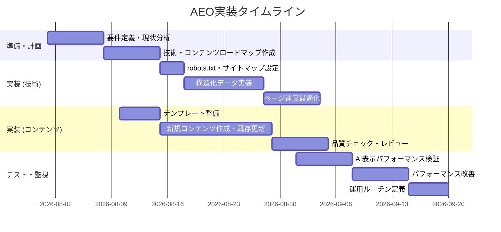

# AEO実装ガイドライン

**エグゼクティブサマリ**  
AI回答エンジン最適化（AEO）には公式ガイドがないため、GoogleやMicrosoftの最新ガイドラインと業界ベストプラクティスを参考に、技術チーム・コンテンツチームが何を実装すべきかを整理します。Googleは従来のSEOの徹底（インデックス可能なコンテンツ、メタ情報、ページ体験の向上）を重視し、Microsoftもタイトル・見出しの明確化やFAQ形式、リスト構造の活用を推奨しています。OpenAIはGPTBot/OAI-SearchBotなどのクローラを導入しており、robots.txtによる制御が可能です。これらを踏まえ、以下に優先タスクのチェックリストと具体的実装手順を示します。

## 優先度順チェックリスト
- **SEO基本の徹底**：サイトがGoogle検索にインデックスされていることを確認し、タイトル・メタディスクリプション・見出し構造を最適化。  
- **高品質コンテンツ作成**：人間向けに独自性・専門性の高いコンテンツを作成。冒頭で結論を簡潔に提示し、信頼できる出典やデータで裏付ける。  
- **構造化データの実装**：FAQPage、HowTo、Article、OrganizationなどのJSON-LD schemaを優先的に設定し、FAQや手順説明を機械判読可能にする。  
- **技術要件**：robots.txtでAIクローラ（GPTBot、OAI-SearchBot）へのアクセスを許可し、サイトマップを登録。ページ速度やモバイル対応を最適化し、Core Web Vitalsをクリアする。  
- **計測とモニタリング**：Google Search Consoleの「生成AIパフォーマンスレポート」を有効化し、Bing Webmaster ToolsのAIパフォーマンスレポートも活用。AI経由のアクセス数・引用ページ数を定期的に確認する。  

## 技術実装タスク
- ### サイトクロール・インデックス  
  - **robots.txt設定**：GPTBotおよびOAI-SearchBotを許可する。特にChatGPTの検索機能に出したい場合、OAI-SearchBotをrobots.txtで許可し、GPTBotの許可設定でコンテンツのAI学習利用を管理する。  
  - **サイトマップ**：XMLサイトマップを生成し、Search Console/Bingに登録。更新頻度の高いコンテンツは IndexNow を設定して迅速に通知する。  
  - **検索エンジン管理**：Google Search ConsoleとBing Webmaster Toolsにサイトを登録し、「AIパフォーマンス」関連のレポートを定期確認。  
- ### メタデータとHTML  
  - **タイトル/H1/ディスクリプション**：タイトルとH1は自然言語で一貫性を持たせ、ページ内容を正確に表現する（例：商品比較なら「○○の比較ガイド」など）。メタディスクリプションは検索意図を説明する文を設定する。  
  - **ヘッディング構造**：`<h2>`, `<h3>` などは論理的かつ質問形式で設定し、AIが情報を抽出しやすい構造にする。Q&A形式の見出しや短い段落で回答を明確にする。  
  - **構造化データ (JSON-LD)**：以下はFAQPageの例です。実際のサイトでは該当ページに合わせてQuestion/Answerを追加してください（実装後にGoogleリッチリザルトテストで検証）:
    ```html
    <script type="application/ld+json">
    {
      "@context": "https://schema.org",
      "@type": "FAQPage",
      "mainEntity": [
        {
          "@type": "Question",
          "name": "例：AEOとは何ですか？",
          "acceptedAnswer": {
            "@type": "Answer",
            "text": "AEO（Answer Engine Optimization）とは、AI検索システムに最適化されたコンテンツ制作手法です。"
          }
        },
        {
          "@type": "Question",
          "name": "例：どのように実装すればいいですか？",
          "acceptedAnswer": {
            "@type": "Answer",
            "text": "コンテンツで質問と回答を明確に分け、JSON-LDのFAQPageスキーマでマークアップします。"
          }
        }
      ]
    }
    </script>
    ```
  - **Canonicalタグ**：重複ページがある場合は`<link rel="canonical">`で正規URLを指定する。AIクローラは無視するが、SEO上の重複回避に有効。  
  - **内部リンク**：関連するページ同士を適切に内部リンクし、サイト全体のトピックを整理する。AIエンジンもサイト構造を理解しやすくなる。  
- ### サーバ・パフォーマンス  
  - **Core Web Vitals最適化**：LCP（Largest Contentful Paint）短縮のため大きな画像はWebP/AVIFに変換し`loading="lazy"`を設定。CLS（Cumulative Layout Shift）対策として画像や広告の枠を固定。INP（Interaction to Next Paint）はJavaScriptの最適化で対応する。  
  - **モバイル対応**：`<meta name="viewport">`を設定し、レスポンシブデザインを採用。タップ領域やフォントサイズを適切にし、スマホ閲覧でも読みやすいUIにする。  
  - **アクセシビリティ**：`alt`属性で画像説明を記載し、見出し順序やARIA属性でスクリーンリーダー対応を行う。WCAG準拠を意識してサイト設計する。  
  - **ステージングで検証**：PageSpeed InsightsやLighthouseを使い、パフォーマンス・アクセシビリティスコアを確認。問題があれば修正してから本番に反映する。

## コンテンツ制作・編集フロー
- ### テンプレート作成  
  - **記事構成テンプレート**：冒頭に質問や結論（Bottom Line Up Front）を明示し、続いて詳細解説、最後に関連FAQや次の質問への誘導を配置する統一フォーマットを用意。  
  - **執筆プロンプト**：新規コンテンツ作成時は「○○について専門家が教える形式で、簡潔な回答と具体例を含めて説明してください」等のプロンプトを設定し、AI下書きやガイドに活用する。  
  - **著者情報・E-E-A-T**：記事には執筆者名・経歴（専門分野）を明記し、専門家監修を受ける。信頼性向上のため、権威ある外部サイトへのリンクや引用を盛り込む。  
- ### QAと品質チェック  
  - **言語品質**：専門用語は適切に使い、日本語の文脈で自然な表現とする。機械翻訳的な語尾回しは避け、フォーマルで簡潔な文体を徹底。  
  - **正確性検証**：事実確認を徹底し、誤字脱字がないかチェック。関連する法律・規制情報は最新のものを引用する。  
  - **E-E-A-T対応**：特に医療・金融などYMYL（「お金・健康」領域）のテーマは、専門家執筆・監修の証拠を提示し、引用元の権威性を担保する。  
- ### スキーマ別コンテンツ  
  - **FAQ/HowTo強化**：ユーザーがよく尋ねる質問や手順をQ&A形式で書き出し、FAQPageやHowToスキーマを付与。例：「**Q：** ○○の使い方は？ **A：** まず△△を行い、その後××します。」  
  - **箇条書き・表の活用**：仕様比較や手順説明では箇条書きや表を使用し、情報を小分けにして明示する。AIはこうした情報片を回答に引用しやすい。  
  - **内部リンクと参考資料**：関連記事や公式資料へのリンクを適宜埋め、ユーザーが深堀りできるようにする。AI回答にも引用されやすい信頼ソースを文中に組み込む。  

## パフォーマンス & アクセシビリティ
- **画像最適化**：必要な画像は次世代フォーマット（WebP/AVIF）に変換し、幅と高さを指定してレイアウトシフトを防ぐ。すべてに`alt`属性をつけ、主要情報はテキストでも提供する。  
- **フォント・リソース**：Webフォントは`<link rel="preload">`で先読みし、サブセット化でサイズ削減。レンダリングをブロックしないよう`font-display: swap`を設定する。  
- **アクセシビリティ強化**：ボタンやリンクには明確なラベルを付与。フォームにもplaceholderではなく<label>を使い、コントラスト比やキーボード操作対応を実施する。  
- **テスト**：LighthouseやSelenium等で自動チェックを行い、A判定基準（WCAG AA）を満たすよう改善する。

## テスト・デプロイ・運用
- ### ステージングでのチェック  
  - Rich Results Test で構造化データのエラーを確認し、PageSpeed Insights でCore Web Vitalsを検証。  
  - 代表的な質問をChatGPTやPerplexityに入力し、自社サイトが引用候補になるかを目視でテスト（あくまで参考）。  
- ### A/Bテストと分析  
  - コンテンツの一部（例：FAQ形式 vs 通常記事）を切り替え、AI参照回数・直帰率・コンバージョン率の差を計測。GA4のイベントやSearch Consoleで成果を評価する。  
- ### モニタリングアラート  
  - GA4/GSCでAI経由のトラフィックや引用回数を定期的にレポート。閾値設定して急激な増減を検知する。  
  - Bing WebmasterのAIパフォーマンスやGoogle Search ConsoleのAIレポートでカバーされるクエリ/ページ動向を監視し、KPIに未達や異常変動があれば即対応。  

## 運用・レポート
- **報告頻度とKPI**：週次または月次でレポートを作成。指標はAI参照数（BingのAIパフォーマンス、GoogleのAIレポート）、AI経由流入数、主要FAQページのクリック率・CVR、総合的な検索順位など。  
- **改善サイクル**：四半期ごとにコンテンツ評価を実施し、情報が古いページは更新・再構成する。AI引用が増えているトピックと減っているトピックを比較し、弱点を洗い出す。  
- **リスク対策**：ガイドライン違反（著作権侵害、ポリシー抵触）が発生した場合は速やかに該当ページを修正またはrobots.txtで非対象指定。AI検索のルール変更にも注意し、公式アナウンスを定期チェックする。  
- **チェックリスト表**：以下に担当別タスク例を示します。

| 担当  | タスク                                     | 詳細例/参照                                             |
|:----:|------------------------------------------|------------------------------------------------------|
| 技術  | robots.txtでGPTBot/OAI-SearchBotを許可     | ChatGPT検索用OAI-SearchBotを許可 |
| 技術  | サイトマップ更新・IndexNow設定            | 新規・更新ページを即座に通知               |
| 技術  | Search Console設定                        | AIパフォーマンスレポートを有効化            |
| 技術  | 構造化データ実装・検証                   | FAQPage/HowTo等のJSON-LDを導入、Rich Results Testで確認 |
| コンテンツ | 見出し・本文を質問形式に編集             | AIが直接回答を抽出しやすい形式に（例：「～とは？」） |
| コンテンツ | FAQ/HowTo形式の充実                    | 頻出質問に簡潔回答を用意し、FAQPageスキーマ付与 |
| コンテンツ | 信頼性向上施策                          | 著者プロフィール追加、外部引用・統計・専門家意見でE-E-A-T強化 |
| 運用  | 定期レポート作成・改善計画              | AI参照数や流入をKPIとし、改善点を四半期毎にレビュー             |
| 運用  | パフォーマンス監視                        | Lighthouse/GA4アラートで速度・エンゲージメントを常時モニタリング |



## 参考資料
- Google Search Central: 「[Google 検索向けの生成AI機能最適化ガイド](https://developers.google.com/search/docs/fundamentals/ai-optimization-guide)」  
- Google Search Central Blog: 「[Search Generative AIパフォーマンスレポートの紹介](https://developers.google.com/search/blog/2026/06/gen-ai-performance-reports)」  
- Microsoft Advertising Blog: 「[AI検索で目立つコンテンツ構造とタイトル](https://about.ads.microsoft.com/blog/post/october-2025/optimizing-your-content-for-inclusion-in-ai-search-answers)」  
- Microsoft Bing Blog: 「[Bing Webmaster Tools のAIパフォーマンス](https://blogs.bing.com/webmaster/February-2026/Introducing-AI-Performance-in-Bing-Webmaster-Tools-Public-Preview)」  
- OpenAI Developer Docs: 「[OpenAIクローラ (GPTBot/OAI-SearchBot)の概要](https://developers.openai.com/api/docs/bots)」  
- Google Documentation: 「[有益で信頼性の高いコンテンツ作成](https://developers.google.com/search/docs/fundamentals/creating-helpful-content)」